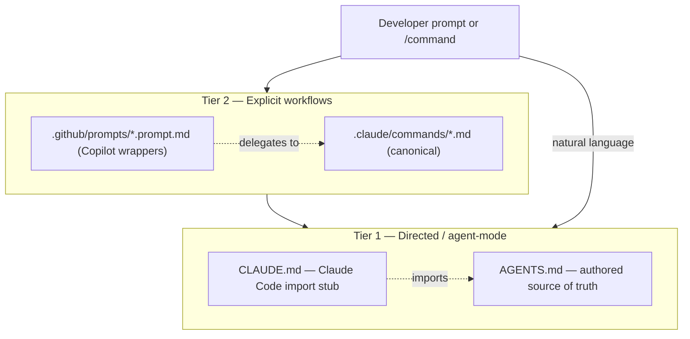
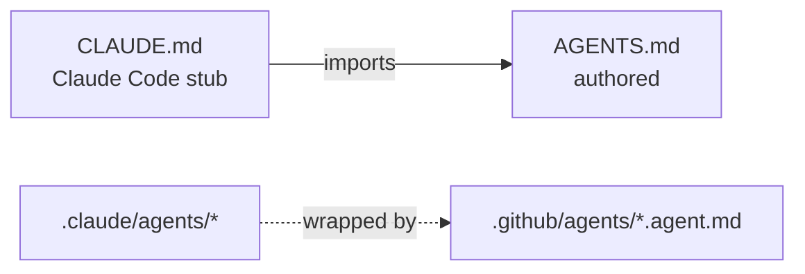

# AI Tech Lead Framework (.NET + Angular) — Architecture

> **Audience.** This is the canonical, human-readable map of what this repo does and how the pieces fit. A senior reviewer should start here, then use [REVIEW-GUIDE.md](./REVIEW-GUIDE.md).
> **AI agents do not read this file** — they read `README.md` → `CLAUDE.md` / `AGENTS.md` and run the workflow commands. This doc is for people.

---

## 1. What it is

A repository framework for a mixed .NET + Angular codebase that authors the team's conventions, architecture, debt priorities, and workflows once, then delivers them through client-specific instruction carriers and hooks. Model delivery and enforcement vary by host and prerequisites; [enforcement-surfaces.md](./enforcement-surfaces.md) is the authoritative matrix.

It is installed into a target repo (see README "Quick Start" / `scripts/install.ps1`), then `/bootstrap` (greenfield) or `/adopt` (existing AI setup) populates it from the real codebase.

---

## 2. Three-tier model



- **Tier 1 — Directed**: `AGENTS.md` (authored, canonical) is read by supported Copilot agent surfaces, GitHub code review, Codex, and Cursor, and by Claude Code through the `CLAUDE.md` stub that imports it. Gemini defaults to `GEMINI.md`; Aider needs explicit read configuration.
- **Tier 2 — Explicit**: `/feature`, `/fix`, … live canonically in `.claude/commands/`; `.github/prompts/*.prompt.md` are thin wrappers that delegate to them (single source per workflow).

---

## 3. Source of truth

For portable rules, `AGENTS.md` is the hand-authored source and `CLAUDE.md` imports it; that layout is **checked in CI**. Project skills are authored once under `.claude/skills/` and discovered there by Claude Code and supported Copilot skill surfaces.



| File | Authored or generated | Consumed by |
|------|----------------------|-------------|
| `CLAUDE.md` | Stub importing `AGENTS.md` and the framework rules | Claude Code |
| `AGENTS.md` | **Authored** (canonical) | Supported Copilot agent surfaces, GitHub code review, Codex, Cursor; Claude Code through `CLAUDE.md` |
| `.claude/skills/` | **Authored** (canonical project skills) | Claude Code and supported Copilot skill surfaces |
| `.github/agents/*.agent.md` | Wrappers over `.claude/agents/` | Copilot custom agents |
| `docs/architecture.html` | Retired placeholder; points back to this file | Humans |

---

## 4. Workflow commands (Tier 2)

Same names in Claude Code (`.claude/commands/`) and Copilot Chat (`.github/prompts/`).

| Command | Purpose |
|---------|---------|
| `/bootstrap` | One-time: analyse only selected profiles (.NET: A1–A7 incl. financial-domain invariants; Angular: A1–A6 for modules, state, components, RxJS, API, build/test/quality; warehouse-SQL: W1–W3) plus one shared A8 skill-discovery pass, then populate AGENTS.md + TECH_DEBT.md and write evidenced project skills under `.claude/skills` |
| `/adopt` | Ingest existing AI artifacts (Cursor/Copilot/Aider/ADRs) into this layout, then `/bootstrap` the gaps |
| `/feature` | Implement at repository-evidenced boundaries; checks for a `specs/<slug>.md` first; verified subtasks; Boy Scout; self-review |
| `/fix` | Cause-first diagnosis; regression test when an evidenced harness exists; outcome-bound fix |
| `/refactor` | Behavior-preserving; baseline tests when available plus other evidenced checks; reports net LOC delta |
| `/design` | Design-only; persists a spec to `specs/<slug>.md` (spec-driven development) |
| `/test` | Smallest risk-relevant tests following project patterns |
| `/debt` | Find/fix bundleable tech debt (Trojan Horse) |
| `/review` | Quality gate — dispatches the auditor subagents (below) |
| `/security-review` | OWASP-style scan (injection, auth/guards, secrets, XSS/DOM sinks) + senior judgement + SECURITY_FINDINGS SLAs |
| `/docs-sync` | Cross-check docs vs code for drift |
| `/rebootstrap` | Deeper periodic re-alignment |

---

## 5. Subagents (`.claude/agents/`, mirrored to `.github/agents/`)

Run in isolated context; return a structured findings table to the parent. Model routing keeps recurring agents cheap.

| Agent | Role | Model |
|-------|------|-------|
| `bootstrap-pass` | One selected-profile analysis pass (.NET A1–A7 / Angular A1–A6 / warehouse-SQL W1–W3) or shared A8 skill discovery during `/bootstrap` | inherit (strong) |
| `security-auditor` | OWASP-style scan (injection, auth/guards, secrets, XSS/DOM sinks); feeds `/security-review` | inherit (strong) |
| `solid-check` | Audits the diff against the five SOLID principles and first-party project evidence; feeds `/review` | inherit (strong) |
| `test-critic` | Test-integrity audit — would each test go red if the code under test broke? Catches over-mocking and tautological/weak assertions; feeds `/review` | inherit (strong) |
| `convention-check` | Diff vs AGENTS.md > Conventions; feeds `/review` | **haiku** |
| `bloat-radar` | Over-abstraction counterweight to Boy Scout; feeds `/review` | **haiku** |
| `debt-radar` | Maps files/areas to TECH_DEBT entries (Trojan Horse) | **haiku** |

---

## 6. Skills (`.claude/skills/`)

Auto-discovered Common-Tasks recipes; the body loads only when triggered (progressive disclosure).

- **.NET:** `add-endpoint` · `add-entity` · `register-service` · `map-warehouse` · `add-warehouse-load` · `perf`
- **Angular:** `add-component` · `add-service` · `add-lazy-route` · `add-signal-store`
- **Both stacks:** `add-tests` · `dependency-audit` · `create-adr` · `enforce-architecture` · `enforce-standards`

---

## 7. Registered hook flows (conditional)

PowerShell hooks are registered for Claude Code (`.claude/settings.json`) and local Copilot (`.github/hooks/hooks.json`) on Windows. Registration proves configuration, not event firing or output consumption. Each arrow below describes script input/output only when that exact host event fires; client consumption varies by event and capability (see `docs/enforcement-surfaces.md`).

```mermaid
sequenceDiagram
    participant U as Developer
    participant A as Agent
    participant H as Hooks
    U->>H: SessionStart / sessionStart (if the host fires it)
    H-->>A: script emits branch, recent commits, debt heat, security findings, workflow primer
    U->>H: UserPromptSubmit / userPromptSubmitted (if the host fires it)
    H-->>A: route-prompt emits the matched workflow's rails
    A->>H: PreToolUse / preToolUse (if the host fires a supported editor/file-write event)
    H-->>A: guard emits a deny for defined suppression/secret patterns; shell writes are outside scope
    A->>H: PostToolUse / postToolUse (if the host fires a supported .cs or .ts editor/file-write event)
    H-->>A: script emits build/type failures and appends mutable local hook telemetry
    A->>H: Stop / agentStop (if the host fires the end-of-turn event)
    H-->>A: boy-scout-check emits advisory cleanup candidates
```

---

## 8. Doctrine (the rules the instruction files encode)

- **Verification Rules** — verify before referencing; never invent APIs/selectors; honour version pinning (in Angular, signals, control-flow, `inject()`, `takeUntilDestroyed` are version-gated); failures are signals (never silence — no `#pragma warning disable`, `@ts-ignore`/`as any`, or suppression). Anti-hallucination.
- **Leanness** — counterweight to Boy Scout's add-bias; no abstraction on data or for speculation. Reconciled with SOLID (#below).
- **SOLID (mandatory)** — apply SRP/OCP/LSP/ISP and derive each stack's injected-service boundary from project evidence and correctness needs; this framework does not require an interface, abstraction, token, or DI container. `solid-check` is semantic; a consumer may choose an evidenced direction check. Data carriers are exempt.
- **Bug-fix scope** — edits serve outcome, compatibility, or verification; requested refactoring remains valid. `OnPush` remains an explicit, verified change.
- **Trojan Horse** — bundle nearby debt cleanup into feature/fix work, so quality compounds without debt sprints.
- **Financial-domain invariants** — decimal precision, idempotency, TOCTOU/check-then-act, rounding — treated as always-possible states even in internal code (chiefly a backend concern, but the frontend must not undermine them).

---

## 9. GitHub vs Bitbucket Data Center

The local files do not depend on the Git remote, but their client delivery does vary. Copilot VS Code hooks are Preview, off by default, org-gated, and the full lifecycle remains uncertified; see README and `docs/enforcement-surfaces.md`.

| Surface | GitHub | Bitbucket Data Center |
|---------|--------|------------------------|
| Copilot in IDE (reads supported repository carriers, including `AGENTS.md` and `.github` adapters) | ✅ | ✅ (local Windows working tree) |
| Copilot VS Code hooks | Preview + org policy; verify with canaries | Same — the Git remote does not enable them |
| Claude Code (`CLAUDE.md`, `.claude/**`) | ✅ | ✅ |
| Copilot CLI hooks (`.github/hooks/`) | Registered locally; firing and consumption vary by event — see `docs/enforcement-surfaces.md` | Same — the Git remote does not enable local hooks |
| Copilot coding-agent cloud hook execution | Unsupported | Unsupported |
| `.github/workflows/` (Actions) | Windows runners | ❌ → `scripts/docs-sync-check.ps1` in Bamboo/Jenkins on a self-hosted Windows agent + required build status |
| Atlassian Rovo Dev | n/a | ❌ Cloud-only |

---

## 10. Quality gates & drift control

- **CI guardrail** — `scripts/docs-sync-check.ps1` on Windows: AGENTS.md bootstrapped + size budget; CLAUDE.md imports it; project skills exist only at the canonical `.claude/skills` location; FRAMEWORK-CONTEXT populated. Wrapped by the GitHub Windows workflow or wired into Bamboo/Jenkins on a self-hosted Windows agent.
- **Eval cases** — read `tests/evals/cases.yaml` as a declarative spec of intended framework behavior (Verification, Leanness, SOLID/DIP, Boy Scout / `takeUntilDestroyed`, no-defensive-overcoding, `bypassSecurityTrust` safety). It records example response patterns and plain-English review rubrics.
- **Version stamp** — `.claude/framework-version.json` + the HTML comment atop `AGENTS.md`; `CHANGELOG.md` records evolution.

---

## 11. Repo map

```
CLAUDE.md                     Claude Code stub importing AGENTS.md and the framework rules
AGENTS.md                     authored source of truth (conventions, architecture, common tasks)
FRAMEWORK-CONTEXT.md          cross-repo context (shared libs, multi-tenancy, dashboard)
README.md                     human + AI-agent entrypoint
TECH_DEBT.md / SECURITY_FINDINGS.md   registers
LEARNINGS.md                  append-only lessons
.claude/commands/             canonical workflows
.claude/agents/               subagents (incl. solid-check)
.claude/skills/               common-task recipes
.claude/hooks/                PowerShell SessionStart, route-prompt, guard, post-write, audit-trail, boy-scout-check scripts
.claude/settings*.json        PowerShell hook registration (PS7 primary, PS5.1 fallback)
.github/prompts|agents|hooks|instructions   distinct Copilot adapters and carriers
.github/workflows/            GitHub Actions (GitHub-only)
scripts/                      docs-sync-check, install, metrics, ci/
specs/                        persistent feature specs (spec-driven development)
docs/impact/                  retired; any existing output is left as-is
docs/                         playbook, defaults, ARCHITECTURE (this), REVIEW-GUIDE, architecture-decisions
tests/evals/                  framework behavior eval suite
```
